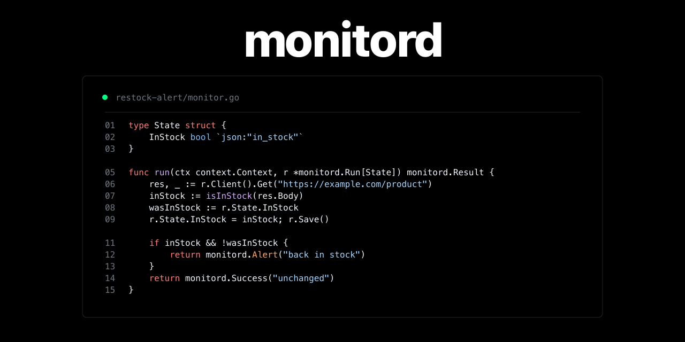

<div align="center">



# monitord

**Stateful monitors. Clean alerts. One small daemon.**

[](https://go.dev)
[](https://sqlite.org/)
[]()

**Monitoring** | **Typed State** | **Long-Lived Workers** | **Discord Alerts** | **CLI Ops**

</div>

---

`monitord` is a local Go daemon for recurring checks that need memory. It handles scheduling, durable state, worker lifecycle, run history, proxy-backed clients, and Discord notifications, while each monitor stays a small Go program focused on one question: did something meaningful happen?

Use it when cron is too stateless and a full job platform is too much.

## Highlights

- Monitoring: run site checks, API health checks, restock alerts, feed watchers, and other recurring "tell me when this changes" jobs.
- State: each monitor owns a typed Go state struct persisted in SQLite across ticks, restarts, and redeploys.
- Lifecycle: `test`, `deploy`, schedule, expire, inspect, and remove monitors through one CLI.
- Workers: deployed monitors run as long-lived worker processes, so HTTP clients, sessions, and caches can survive between ticks.
- Discord: send rich embeds for alerts, failure edges, recoveries, and deduped per-target events.
- Proxies: import proxy pools once, then assign managed proxy clients at deploy time without putting credentials in source.

## Code

Monitors are ordinary Go programs. The daemon provides typed state and a managed HTTP client; the monitor returns `Success`, `Failure`, or `Alert`.

```go
type State struct {
	InStock bool `json:"in_stock"`
}

func main() {
	monitord.Main(monitord.Definition{Name: "restock-alert", Clients: 1}, run)
}

func run(ctx context.Context, r *monitord.Run[State]) monitord.Result {
	res, _ := r.Client().Get("https://example.com/product")
	inStock := isInStock(res.Body)

	wasInStock := r.State.InStock
	r.State.InStock = inStock
	r.Save()

	if inStock && !wasInStock {
		return monitord.Alert("back in stock").
			WithURL("https://example.com/product")
	}

	return monitord.Success("unchanged")
}
```

Discord messages are embeds. Add fields when the alert should be useful without opening logs:

```go
return monitord.Alert("back in stock").
	WithURL("https://example.com/product").
	WithField("Product", "Everyday Hoodie", true).
	WithField("Size", "Medium", true).
	WithField("Price", "$68", true).
	WithField("Signal", "page contains `In Stock`", false)
```

## CLI

```bash
infra/install.sh

monitord init
monitord route create discord alerts --webhook-url "$DISCORD_WEBHOOK_URL"

monitord new restock-alert
$EDITOR ~/.monitord/monitors/restock-alert/monitor.go
monitord test restock-alert

monitord deploy restock-alert --every 5m --ttl 24h --route discord:alerts
monitord list
```

Useful commands:

```bash
monitord inspect restock-alert
monitord runs restock-alert
monitord runs restock-alert --failed
monitord runs restock-alert --run RUN_ID
monitord stats restock-alert
monitord state get restock-alert
monitord expire restock-alert
monitord rm restock-alert --purge
```

`--root PATH` may appear anywhere in CLI arguments and defaults to `$MONITORD_ROOT` or `~/.monitord`.

## State

State is decoded by the monitor binary itself. Deploy validates stored state against the new struct before accepting a new artifact, so schema drift fails early instead of silently dropping data.

When the shape changes, version and migrate it:

```go
func (State) StateVersion() int { return 2 }

func (s *State) MigrateState(from int, raw json.RawMessage) error {
	// Decode the old shape and populate s.
	return nil
}
```

State commands:

```bash
monitord state get restock-alert
monitord state set restock-alert ./state.json
echo '{"in_stock":false}' | monitord state set restock-alert -
monitord state clear restock-alert
```

## Notifications

`Failure` notifications are edge-triggered: one message when a monitor starts failing and one when it recovers. `Alert` sends every time it is returned, which is the right fit for healthy checks that found something interesting.

Routes are local labels for Discord webhooks:

```bash
monitord route create discord alerts --webhook-url "$DISCORD_WEBHOOK_URL"
monitord route test discord:alerts
monitord deploy restock-alert --route discord:alerts --mention user:USER_ID
monitord deploy quiet-watch --route discord:alerts --mention none
```

Mentions accept `user:ID`, `role:ID`, `here`, `everyone`, comma-separated combinations, or `none`. They are sent through Discord `allowed_mentions`, so scraped content cannot create surprise mass pings.

## Install And Update

```bash
infra/install.sh
infra/install.sh --ref v1.2.3
infra/install.sh --no-restart
```

The installer is idempotent. It keeps a pinned clone under `~/.monitord/lib`, builds `bin/monitord`, symlinks it to `~/.local/bin/monitord`, initializes the root layout, retidies the monitors module, and installs a user background service when supported.

Supported service modes:

- macOS: launchd user LaunchAgent
- Linux: systemd user service
- Other environments: `MONITORD_SERVICE=none`

Useful overrides:

```bash
MONITORD_ROOT="$HOME/.monitord" infra/install.sh
MONITORD_REPO="https://github.com/OWNER/monitord.git" infra/install.sh
MONITORD_SERVICE=none infra/install.sh
```

Foreground mode:

```bash
monitord daemon --interval 5s --concurrency 8
```

## Proxies

Import a pool once, then attach it when deploying a monitor:

```bash
monitord proxy import residential ./proxies.txt
monitord proxy list
monitord deploy catalog-watch --proxies residential --route discord:alerts
```

The monitor declares `Clients: N`; monitord assigns that many proxy-backed clients to the worker. Proxy credentials live in monitord state, not monitor source or process arguments.

## AI Skill

`monitord skill` prints the embedded `SKILL.md` for agents that can operate monitors on your behalf:

```bash
mkdir -p /path/to/agent/skills/monitord
monitord skill > /path/to/agent/skills/monitord/SKILL.md
```

## Development

```bash
go test ./...
bash -n infra/install.sh
bash -n infra/run.sh
```

Main directories:

- `cmd/monitord`: CLI entrypoint
- `infra`: installer, service runner, and README assets
- `internal/daemon`: scheduler and worker supervision
- `internal/storage`: SQLite persistence
- `internal/routes`: notification routes
- `internal/monitor`: scaffold, build, describe, and artifact lifecycle
- `internal/model`: shared names, statuses, and validation
- `examples/http-watch`: example monitor
